# Acceso remoto  SSH

## 2.2 Primera conexión SSH desde cliente GNU/Linux

* Conexión entre cliente servidor:

 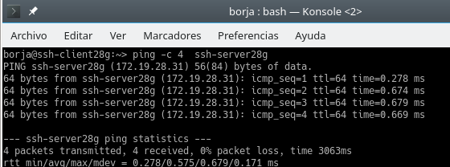

* Comprobamos el puerto abierto del SSH en el servidor:
> nmap -Pn ssh-serverXXg

 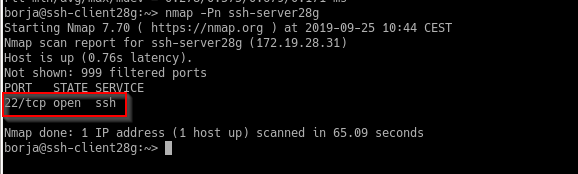

 * Comprobamos el funcionamiento de la conexión ssh conectandonos desde la mv cliente con el usuario garcia1, y el intercambio de claves que se produce en el primer proceso de conexión:

 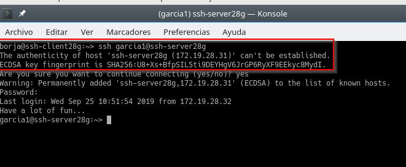

 Una vez establecemos conexión, en el fichero .ssh/Known_hosts aparecerá la clave de identificación de la máquina ssh-server. Es decir, este fichero valida la conexión entre la mv ssh-client con el usuario garcia1:

 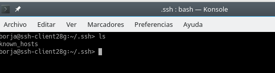

 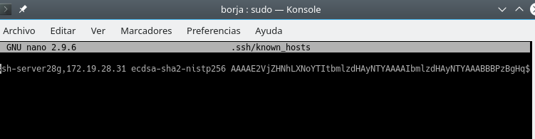

 ## 3.2 Comprobar cambio clave servidor ssh

Al generar nuevas claves públicas/privadas para identificar nuestro servidor, la clave de identificación del mismo cambia por lo que ya no será la misma que tiene el cliente en su fichero .ssh/Known_hosts y por lo tanto al intentar hacer conexión nos saldrá un aviso de que la identificación del servidor ha cambiado :

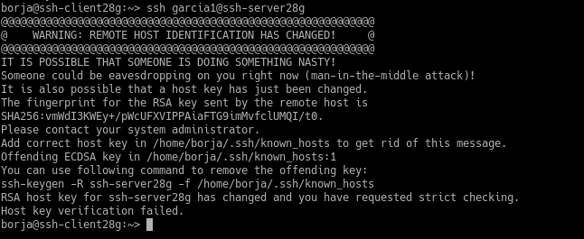

## 5. Autentificación mediante claves públicas
> Supongamos que queremos acceder desde el ssh-clientXXg sin necesidad de escribir la clave. Para ello, vamos a configurar la  autenticación mediante clave pública para acceder con nuestro usuario personal desde el equipo cliente al servidor con el usuario 1er-apellido-alumno4 sin necesidad de clave.

Utilizando el usuario de la mv **ssh-clientXXg**, ejecutamos el siguente comando: **ssh-keygen -t rsa** , para generar un nuevo par de claves púlicas para el usuario:
> Cómo indica la imagen, la identificación del usuario será guardada en **/home/borja/.ssh/id_rsa** y la clave pública en **/home/borja/.ssh/id_rsa.pub**  

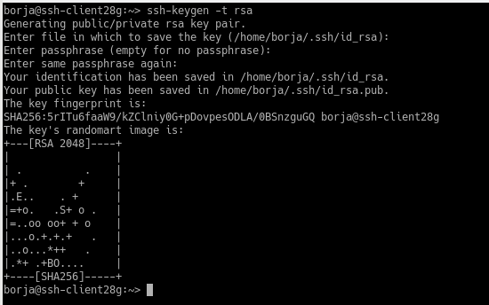

Ahora procedemos a copiar la clave pública (id_rsa.pub) al fichero "authorized_keys" del usuario garcia4 que está definido en el servidor. Para ello usaremos el comando **ssh-copy-id** de la siguiente forma: ssh-copy-id garcia4@ssh-server28g :

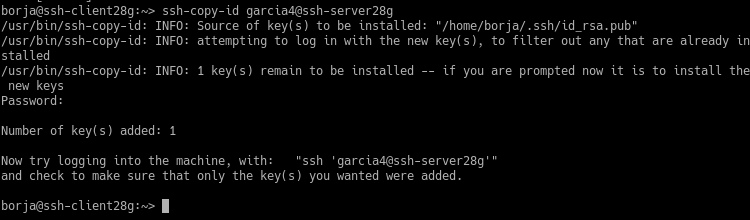

Comprobamos el acceso:

1. Desde ssh-clientXXg (no debe pedir clave):

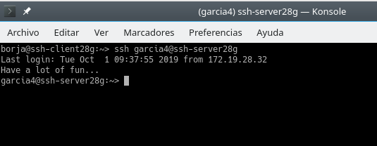

2. Desde ssh-clientXXw (Debe pedir clave):

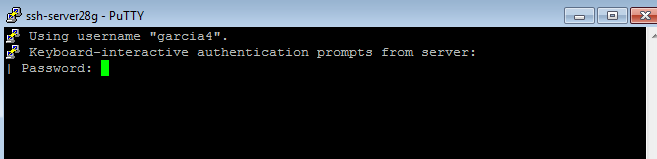

## 6. Uso de SSH como túnel para X

Instalamos en el servidor una aplicación de entorno gráfico que no esté en los clientes.

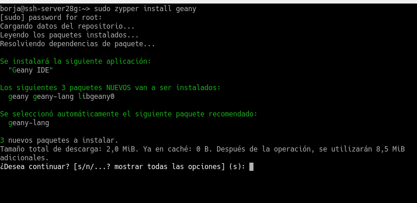

Comprobamos si el fichero de configuración /etc/ssh/sshd_config (Opción X11Forwarding yes) para permitir la ejecución de aplicaciones gráficas desde los clientes:

> En caso de que este en no, cambiar a yes y reiniciar el servicio para que se guarden los cambios

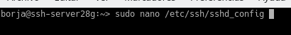

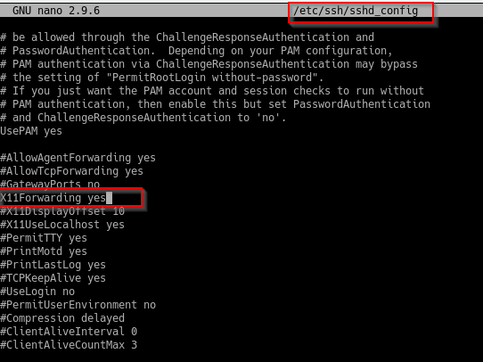

Vamos al clienteXXg y ejecutamos **zypper se nombre-aplicación** para comprobar que no está instada:

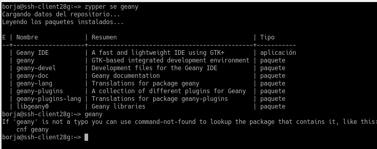

Vamos a comprobar desde ssh-clientXXg, que funciona APP1(del servidor) Para ello, nos conectamos de forma remota al servidor de la siguiente forma:
ssh -X garcia1@ssh-server28g y ejecutamos la app :

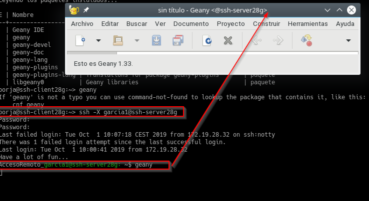

## 8.1 Restricción sobre un usuario

Vamos a crear una restricción de uso del SSH para un usuario. Para ello modificaremos el fichero /etc/ssh/sshd_config añadiendo la línea DenyUsers Nombre de usuario

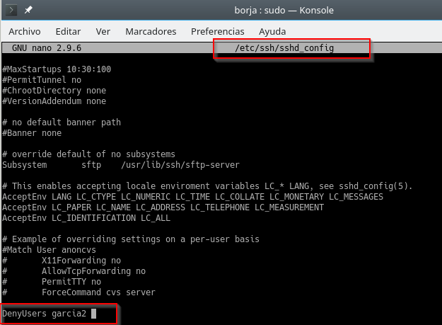

Procedemos a entrar con el usuario al que se le ha creado la restricción:

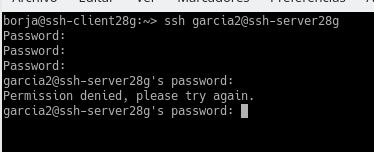
