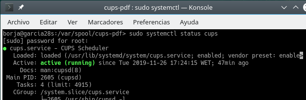
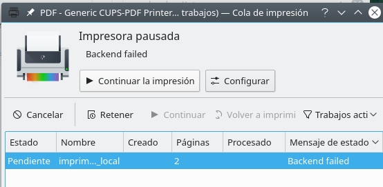
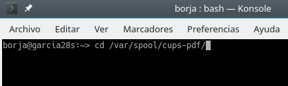
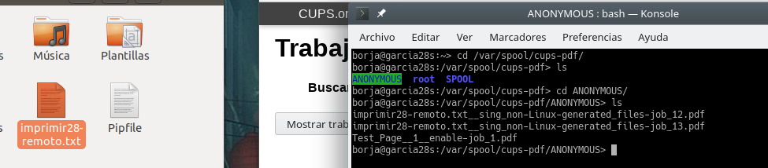

# Servidor de Impresión GNU/Linux(CUPS)

## 2. Comprobar que el Servidor está en ejecución:

## 3. Comprobar que imprime de forma local:
> Error a  imprimir en local

## 4. Comprobar que imprime de forma remota:

