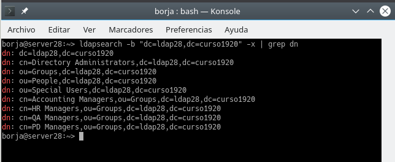
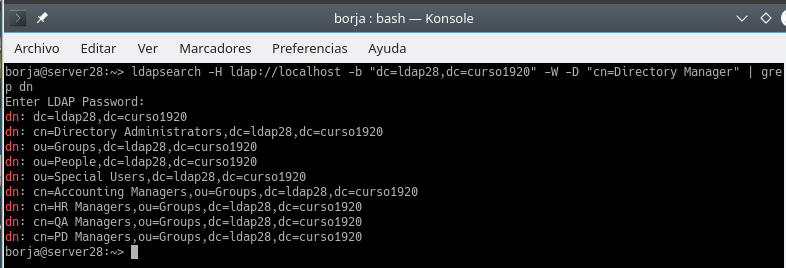
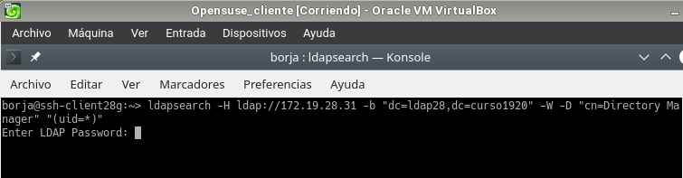
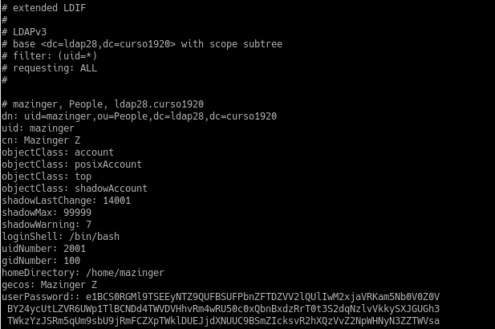
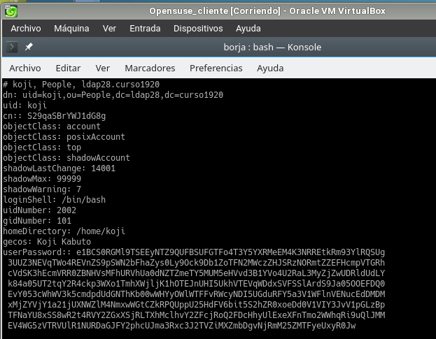
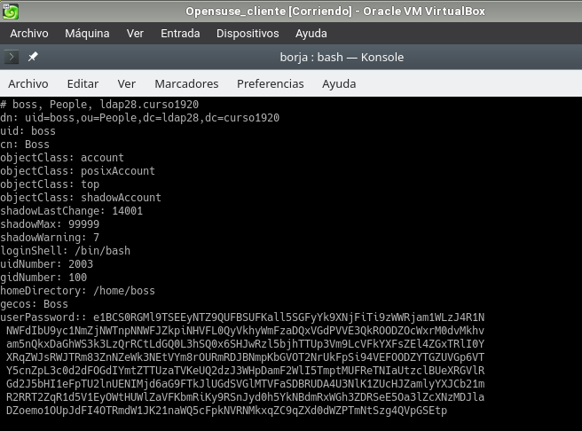
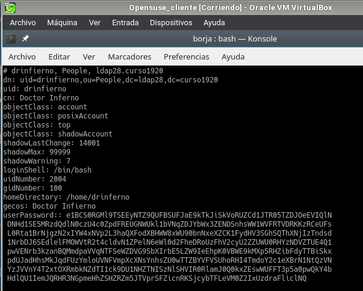

# Servicio de Directorio con comandos

## 2.3 Comprobar contenido del DS LDAP

* ***ldapsearch -b "dc=ldapXX,dc=curso1920" -x | grep dn***, muestra el contenido de nuestra base de datos LDAP.

 

* *** ldapsearch -H ldap://localhost -b "dc=ldapXX,dc=curso1920" -W -D "cn=Directory Manager" | grep dn *** , en este caso hacemos la consulta usando usuario/clave.
 

 ## 3.3 Comprobar nuevo usuario
* *** ldapsearch -W -D "cn=Directory Manager" -b "dc=ldapXX,dc=curso1920" "(uid=*)" ***, para comprobar si se ha creado el usuario en el LDAP.
  

## 4.3 Comprobar los usuarios creados
* Ir a la MV cliente LDAP

* Usuario Mazinger
 

* Usuario Koji

* Usuario Boss

* Usuario Doctor Infierno

