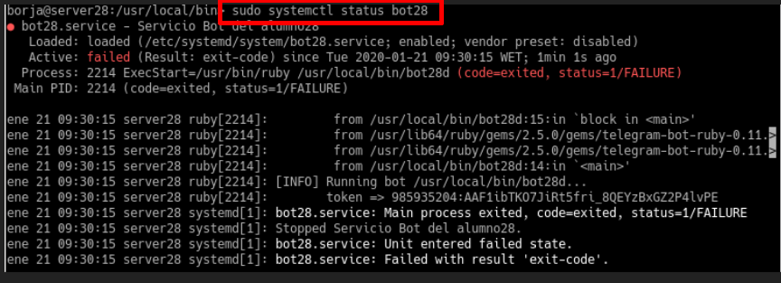
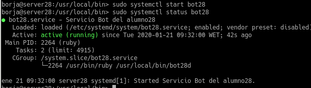
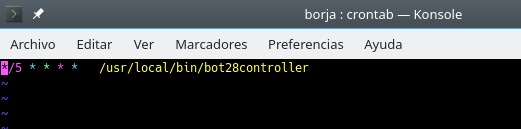
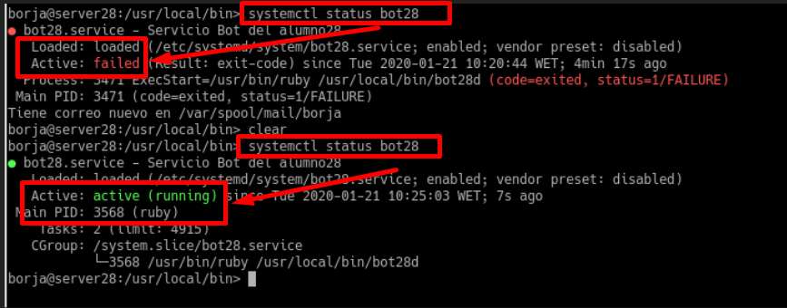

## Servicio de comunicaciones con Telegram(bot-service)

## 1.4 Entrega
- Entregrar el script del bot(/usr/local/bin/botxxd)

~~~
#!/usr/bin/env ruby

#!/usr/bin/env ruby

require 'telegram/bot'

token = `cat /etc/bot28/token/hide.token`.strip
bot_username = '@Bot_borja28'

puts "[INFO] Running bot #{$0}..."
puts "       token => #{token}"

Telegram::Bot::Client.run(token) do |bot|
  bot.listen do |message|
    puts " => #{message.text}"
		if message.text == "/hello"
	  	bot.api.send_message(chat_id: message.chat.id, text: "Hello Word!")
		elsif message.text == "/byebye"
	  	bot.api.send_message(chat_id: message.chat.id, text: "Bye bye!")
		elsif message.text == "/ping"
			ping = `ping -c 4 8.8.8.8`
			bot.api.send_message(chat_id: message.chat.id, text: ping)

		end
  end
end
 ~~~

 - URL vídeo Youtube donde se muestre el Bot en funcionamiento.

https://www.youtube.com/watch?v=Qo-BVxJffeA

## 2.4 Entrega

- Fichero de configuración del servicio /etc/systemd/system/botXX.service.

~~~

#!/usr/bin/env ruby

status  = `sudo systemctl status bot28 | grep Active:`.split()

if status[1] != "active"
  `sudo systemctl start bot28`
end
~~~

- Capturas de pantalla donde se muestre que podemos iniciar y parar el servicio botXX con el comando systemctl.

## 3.2 Tareas programadas

- automatización
> crontab -e --> cada 5 minutos se lanzará el scrip  /usr/local/bin/bot28controller

- Comprobación

