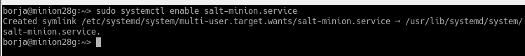

# 1. Salt-stack
Hay varias herramientas conocidas del tipo gestor de infrastructura como Puppet, Chef y Ansible. En esta actividad vamos a practicar Salt-stack con OpenSUSE.

# 2. Preparativos
Para esta realizar la siguiente práctica necesitaremos dos máquinas virtuales, una Master con a la cual le cambiaremos el hotsname a  **masterXXg** y otra Minion a la cual le cambiaremos el hostname a **minionXXg**. Ambas utilizaran como OS **OpenSUSE**

# 3. Master: instalar y configurar

Empezamos instalando en la mv Máster el software del Máster:

Modificamos el fichero **/etc/salt/master** con la siguiente configuración:

Habilitamos el servicio salt-master:

Lo iniciamos:

Consultamos los Minions aceptados por nuestro Máster. **salt-key -L** . No debería haber nada todavía

# 4. Minion
> Los minios son los equípos que van a estar bajo control del Máster
## 4.1 Instalación y configuración
Instalamos el software del agente minion en nuestra máquina minionXXg

Modificamos el fichero */etc/salt/minion* para definir quien será nustro Máster:

Activamos el servicio del Minion:

Iniciamoso el servicio:;

Comprobamos que no tenemos instalado apache2 en el Minion:

## 4.2 Aceptación desde el Máster

Desde la máquina del Máster y teniendo en cuenta que el cortafuegos acepta las peticiones del servicio Salt, ejecutamos el comando **salt-key -L** para ver la petición del Minion:

Lanzamos el comando salt-key -a minionxxg para acceptar la petición:

## 4.3 Comprobación de conectividad

*  **salt '*' test.version**:

* **salt '*' test.ping**

# 5. Preparar el directorio para los estados

* Crear directorios **/srv/salt/base** para guardar nuestros estados y **/srv/salt/devel** para desarollo o para hacer pruebas :

* Crear archivo **/etc/salt/master.d/roots.conf** con el siguiente contenido:

Reiniciamos el servicio Máster:

## 5.1 Crear un nuevo estado

* Crear fichero **/srv/salt/base/apache/init.sls** de la siguiente forma:

## 5.2 Asociar Minions a estados

En el Máster, crear **/srv/salt/base/top.sls** donde asociamos a todos los Minions con el estado que acabamos de definir:

## 5.3 Comprobar el estado definido

Comprobamos con **salt '*' state.show_states**:

## 5.4 Aplicar el nuevo estado

En el Máster consultamos los estados en detalle y verificamos que no hay errores en las definiciones:

* **salt '*' state.show_lowstate**

* **salt '*' state.show_highstate**

Aplicamos el estado con en todos los minions usando el comando **salt '*' state.apply apache**

# 6. Crear más estados

Vamos a crear un estado llamado users que nos servirá para crear un grupo y usuarios en las máquinas Minions.

* Crear directorio **/srv/salt/base/users**:

* Crear fichero **/srv/salt/base/users/init.sls**

Dentro del mismo creamos el grupo mazingerz y los usuarios kojiXX y drinfernoXX:

Aplicamos el estado:

## 6.1 Crear estado directories

* Crear estado drectories para crear las carpetas private (700), public (755) y group (750) en el home del usuario koji.

* Aplicamos el estado:

# 7. Añadir Minion de otro SO

Desde una MV con SO Windows, instalar salt-minion y enviar una petición al Máster:

Comprobamos que se ha rellizado la petición con éxito:

