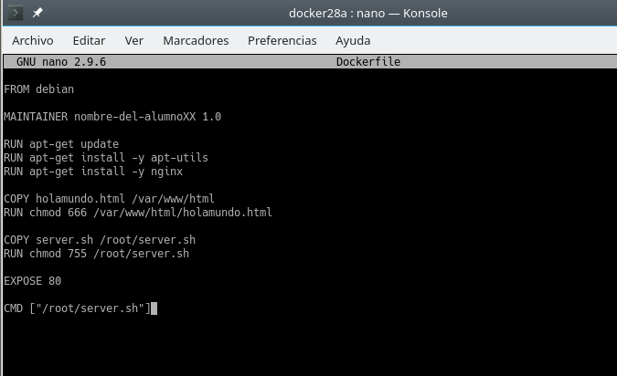
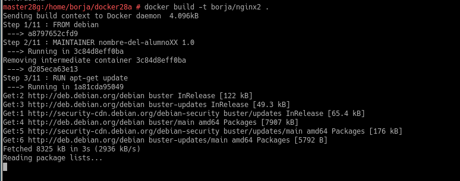

# 1. Contenedores con Docker
Docker nos permite crear "contenedores", que son aplicaciones empaquetadas auto-suficientes, muy livianas, capaces de funcionar en prácticamente cualquier ambiente, ya que tiene su propio sistema de archivos, librerías, terminal, etc.

Docker es una tecnología contenedor de aplicaciones construida sobre LXC.

# 2. Configuraciones pertinentes e instalación

Si queremos que nuestro contenedor tenga acceso a la red exterior, debemos activar tener activada la opción IP_FORWARD

## 2.1 instalación

Comenzamos instalando la herramienta Docker.

Iniciamos el servicio

Comprobamos la versión cliente y servidor.

## 2.2 Primera prueba

Mostramos las imágenes descargadas hasta ahora(No debe de haber ninguna)

Mostramos los contenedores creados(No debe de haber ninguna)

Procedemos a descargar la imagen **hello-world**.

Mostramos la imagen descargada.

Comprobamos que hay un contenedor en estado "Exited"

# 3. Crear un contenedor manualmente

Con el comando **docker search debian** Buscamos en los repositorios de Docker Hub contenedores con la etiqueta Debian

Descargamos una imagen Debian en local y comprobamos la descarga

Creamos un contenedor de nombre con_debian utilizando la imagen anterior y ejecutaremos el programa /bin/bash dentro del contenedor

## 3.1 Personalizar el contenedor

Comprobamos que estamos en Debian.

Actualizamos los repositorios del contenedor.

Instalamos el servidor Nginx en el contenedor.

Instalamos el editor vim.

Creamos el fichero HTML holamundo.html en /var/www/html/

Creamos un script /root/server.sh.

Introducimos el siguiente contenido.

Le damos permisos de ejecución.

## 3.2 Crear una imagen a partir del contenedor

En otra ventana de terminal ejecutar **docker commit con_debian nombre-del-alumno/nginx1**.

Comprobamos que la imagen se ha creado.

# 4. Crear contenedor a partir de nuestra imagen.
## 4.1 Crear contenedor con Nginx

* Ejecutamos: **docker run --name=con_nginx1 -p 80 -t nombre_imagen /root/server.sh** para iniciar el contenedor a partir de la imagen anterior.

## 4.2 Comprobamos

En otro terminal, ejecutamos **docker ps** para mostrar el contenedor en ejecución y la redirección a un puerto local.

Abrimos el navegador e introducimos 0.0.0.0:puerto del contenedor.

Comprobamos el acceso a holamundo.html.

Paramos el contenedor y lo eliminamos.

## 4.3 Migrar la imágen a otra máquina

Exportamos la imagen en un fichero tar utilizando **docker save -o ~/alumnoXX.tar nombre-alumno/nginx1,**

# 5 Dockerfile

Ahora vamos a conseguir el mismo resultado del apartado anterior, pero usando un fichero de configuración. Esto es, vamos a crear un contenedor a partir de un fichero Dockerfile. El fichero Dockerfile contiene toda la información necesaria para construir el contenedor

## 5.1 Preparar ficheros

Creamos el direcctorio /home/nombre-alumno/dockerXXa y entramos en el mismo.

Creamos el fichero holamundo.html anterior

De la misma forma, también creamos el fichero server.sh anterior.

Creamos un fichero **Dockerfile** e introducimos el siguiente contenido.

## 5.2 Crear la imagen a partir del Dockerfile

Dentro del directorio dockerXXa, ejecutar **docker build -t nombre-alumno/nginx2 .**

Comprobamos que se ha creado nuestra imagen.

## 5.3 Crear contenedor y comprobar

Creamos un contenedor con el nombre con_nginx2, a partir de la imagen nombre_alumno/nginx2. Para ello utilizaremos el siguiente comando **docker run --name=con_nginx2 -p 8080:80 -t nombre-alumno/nginx2**

Desde otra terminal, ejecutamos el comando docker ps para averiguar el puerto de escucha del servidor Nginx

Comprobamos desde el navegador.

## 5.4 Usar imágen ya creadas

Creamos el directorio dockerXXb. Entrar al directorio.

Creamos el fichero de configuración Dockerfile con lo siguiente en su interior.

Creamos la imagen nombre_alumno/nginx3 y Creamos el contenedor utilizando la imagen.

Comprobamos:

